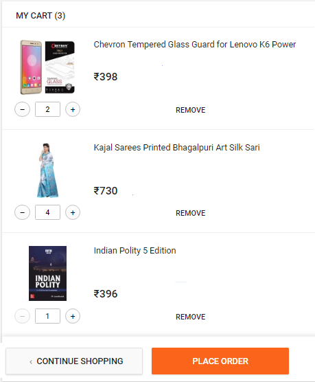

## 1. Shopping Cart

Your task is to implement a basic shopping cart for a website, following these basic rules:



* Store the cart on localStorage
* The cart should only know about item IDs and their quantity
* The cart should notify when it has been updated
* UI could be like flipkart cart, the functionality you should implement is add/remove items, increment/decrement item count and update localStorage on any change
* The UI should be clean
* Focus on the cart, other parts are just helpers
* Dummy data should be used for the cart items

<!--* the cart should be retrieved from the localStorage, where it's stored under the key `cart`
* every time an action is performed on the cart, it should be persisted on the localStorage
* the cart should only know about item IDs and their quantity
* you will write the cart by implementing the methods of the provided cart service in the code block below.

``` javascript
angular.module('services.cart', [])
    .service('Cart', ['$rootScope', 'Reviewer', function ($rootScope, Reviewer) {
        var getCart = function(){};

        var addItem = function(){};

        var addItems = function() {};

        var save = function() {};

        var remove = function () {};

        var clear = function() {};

        var persist = function() {};

        var changeQuantity = function (){};

        var refresh = function() {};
    }]);
```

### Methods explanation

For some of the methods mentioned in the empty Cart service, we thought of giving you some explanation to better understand what they're there for.

#### Save

Checks if the cart can be persisted through the `Reviewer` service: if so, it `persists` it.

#### Clear

Empties the cart

#### Persist

Persist the cart on the localStorage

#### changeQuantity

Changes the quantity of one of the items in the cart.

#### Refresh

Notifies the application that the cart has been persisted, so that other parts of the app can modify themselves based on the latest cart update.

### Dependencies

You are not allowed to inject any dependency on the Cart service other than the ones provided:

* `$rootScope`: you might want to use it for whatever reason (for example, triggering events)
* `Reviewer`: it's an angular service that will review the contents of the cart (`Reviewer.review(cart)`, returns a promise)

Concentrate on the design of the `Cart` service.

The above functions are for a Angular service. You can choose framework of your choice (or better write without using any framework).-->
